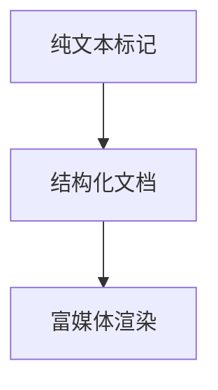
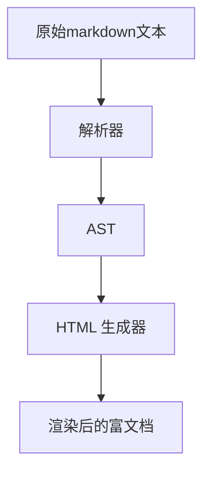

# markdown进阶笔记

## 底层原理

- 核心本质：轻量级标记语言的设计逻辑

Markdown 诞生于 2004 年，markdown的核心目标是易读易写、可直接转换为 HTML。

1. 纯文本层：用极简符号（ # 、 * 、 - 、   等）标记文本结构，完全兼容普通文本编辑器。
2. 结构化层：解析器（Parser）将标记符号映射为 HTML 标签（如  # 标题  :` <h1>`标题`</h1> `， *列表*  →: `<ul><li>` 列表 `</li></ul>` ）。

3. 渲染层：浏览器/编辑器通过 CSS 样式将 HTML 渲染为可视化的富文档（不同渲染器的差异会导致同一份 Markdown 显示效果不同）。

- 核心流程

- 核心优势

  1. 纯文本兼容性：所有标记符号都是 ASCII 字符，无二进制格式，可在任何文本编辑器中打开、编辑，不会出现乱码。

  2. 语法极简性：仅保留写作必需的标记，避免冗余如 

     eg：HTML 需写  `<h1> `，Markdown 仅需  # 。

  3. 可扩展性：通过扩展语法（如 LaTeX 公式、Mermaid 流程图、脚注）满足复杂场景，核心是基础语法统一，扩展语法按需添加。（！）

  4. 渲染一致性问题：不同解析器对扩展语法的支持不同，这是 Markdown 底层的核心 trade-off（为了易用性牺牲了 100% 渲染一致性）。

## mark down编译器奇妙与方便的功能（typora）

1. 所见即所得，面板简洁明了，有文件&大纲的侧浏览条，可点击跳转、折叠层级。

2. 有专注模式&打字机模式

   - 专注模式：全屏高亮当前段落，屏蔽干扰，沉浸式写作；

   - 打字机模式：当前输入行始终居中，滚动时自动对齐，长文档写作更舒适。
